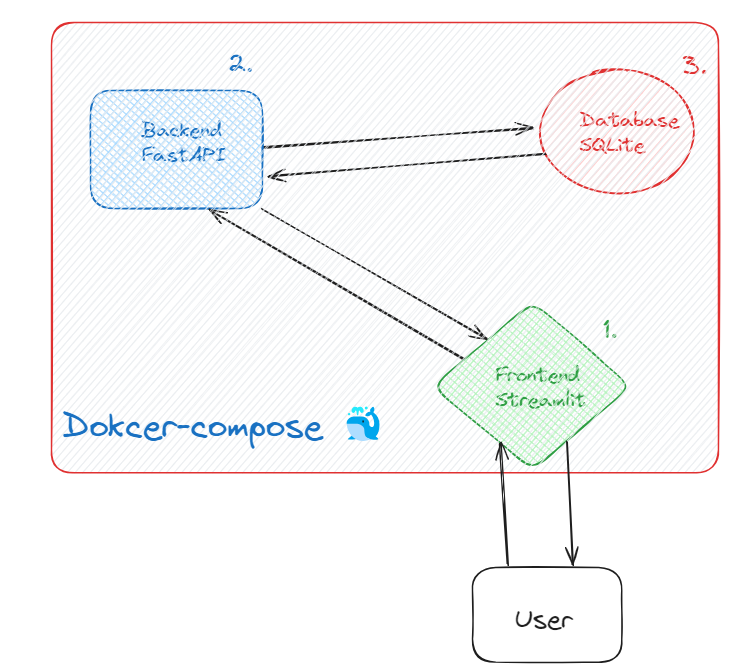
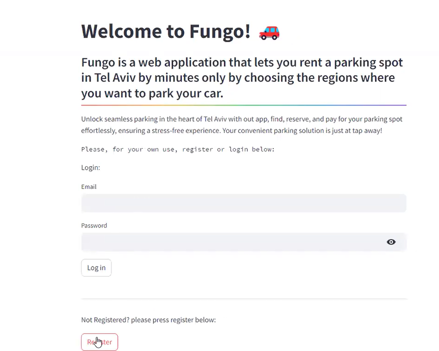

# Fungo-app

**#NOTE:**
**The program is installed in branch "master"**

### Short explanation
Fungo app is a web application, that lets you rent a parking spot in Tel Aviv by regions.
Each region has it's own price (defined by the project) and there are also regions explanation inside the app
on how much time you can rent it, and how much does it cost by the system.

### installation
To clone this project to you computer, please do the next steps:
```
gh repo clone EASS-HIT-PART-A-2024-CLASS-IV/Fungo-app
```
Then, go to Fungo-app file:
```
cd Fungo-app
```
Go to branch master using the next command:
```
git checkout master
```
To run this program, do the next command, and make sure Docker Desktop is open:
```
docker-compose up --build
```
This will open up the containers, and you will be able to open the project at [http://localhost:8501/
](http://localhost:8501/)

Enjoy!

## Illustration



## Short Video

[](https://youtu.be/ruA3-FkaJJ4)

## Requirements
* Microservice
* Backend
* Frontend
* Docker 🐳
* Docker-compose 

**Project tree:**
```
.
├── backend
│   ├── Dockerfile
│   ├── __init__.py
│   ├── backend_main.py
│   ├── db_areas.py
│   ├── requestsPyda.py
│   └── requirements.txt
├── database
│   ├── Dockerfile
│   ├── __init__.py
│   ├── database.py
│   ├── db_connection.py
│   ├── db_server_main.py
│   ├── models.py
│   ├── requestsPyda_db.py
│   └── requirements.txt
├── docker-compose.yml
└── frontend
    ├── Dockerfile
    ├── data.py
    ├── frontend_main.py
    ├── info.py
    ├── login.py
    ├── main_pg.py
    ├── parking.py
    ├── register.py
    └── requirements.txt
```

## Built with:
**Frontend** -> Streamlit
**Backend** -> Python, FastAPI
**Database** -> SQLite, FastAPI